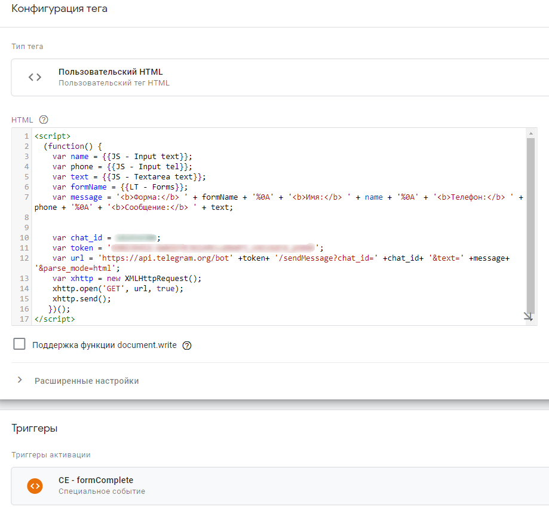

# Отправка сообщений в Телеграм средствами GTM
Скрипт для отправки уведомлений в Телеграм через GTM. Скрипт устанавливается через HTML тег. Триггер срабатывания тега вы устанавливаете на своё усмотрение.

Прошу обратить внимание, что вам придётся самостоятельно позаботиться об получении данных, которые вы захотите отправлять с помощью данного скрипта. Также ваши данные для отправки должны быть доступны в момент срабатывания триггера, иначе вы будете получать пустое сообщение.

```
<script>
  (function() {
    //Получаем данные, которые необходимо отправить
    var name = {{JS - Input text}};
    var phone = {{JS - Input tel}};
    var text = {{JS - Textarea text}};
    var formName = {{LT - Forms}};
    
    //Формируем сообщение из полученных данных
    var message = '<b>Форма:</b> ' + formName + '%0A' + '<b>Имя:</b> ' + name + '%0A' + '<b>Телефон:</b> ' + phone + '%0A' + '<b>Сообщение:</b> ' + text;
    
    var chat_id = <id>; //id получателя или группы
    var token = <token>;  //Ваш токен. Указываем в кавычках
    
    //Тут лучше ничего не трогать
    var url = 'https://api.telegram.org/bot'+token+'/sendMessage?chat_id='+chat_id+'&text='+message+'&parse_mode=html';
    var xhttp = new XMLHttpRequest();
    xhttp.open('GET', url, true);
    xhttp.send();
  })();
</script>
```
## Пример тега


